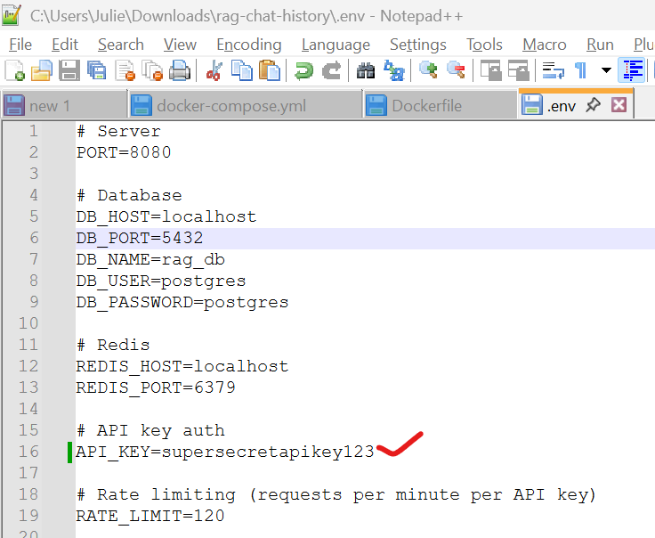
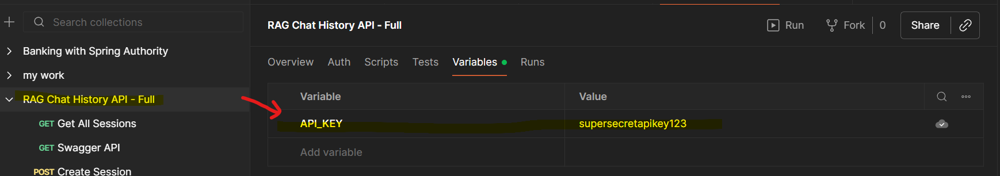
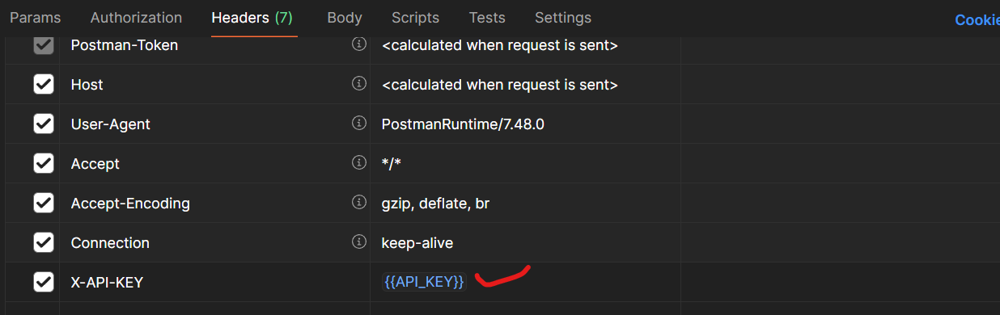
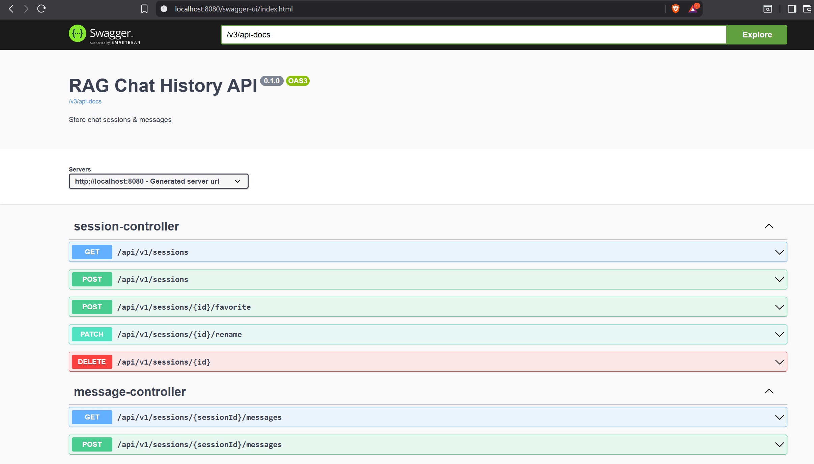
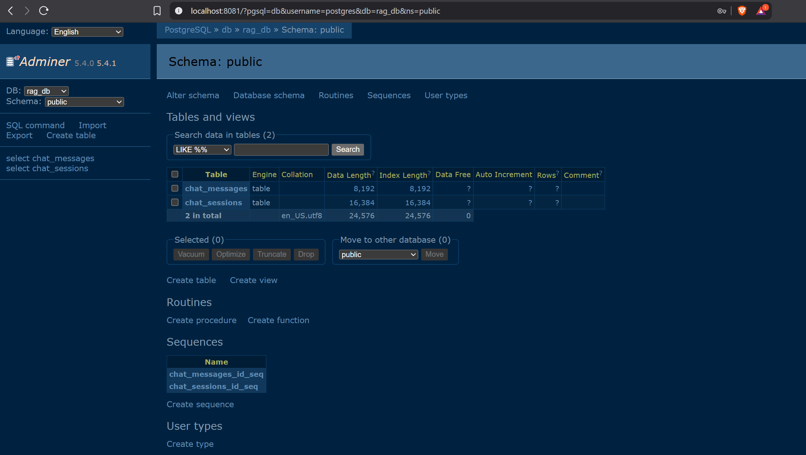
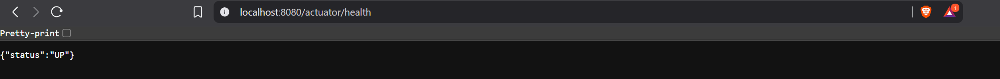

# RAG Chat History Service (Spring Boot, Java 17, Maven)

A production-ready microservice to store chat sessions and messages used by a RAG chatbot.

## Features
- Spring Boot + PostgreSQL + Redis rate limiter
- API Key auth (`X-API-KEY`)
- Session CRUD, message storage, rename, favorite, delete
- Swagger/OpenAPI UI
- Dockerized (app, postgres, redis, adminer)

## Required softwares to run in local
- JDK 17+
- Maven
- Docker Desktop
- Postman
- Intellij or any other IDE for editing code


## Quick start (using Docker Compose)
1. Set `API_KEY` in `.env` inside 'rag-chat-history' folder
   
2. Run below command in Command prompt inside 'rag-chat-history' folder:
   ```bash
    mvn clean package -DskipTests
   ``` 
   This will generate rag-chat-history-0.1.0.jar inside 'rag-chat-history/target' folder
3. Build & run the project in Docker:
   ```bash
   docker-compose build --no-cache ##forces Docker to rebuild from scratch, ignoring all cached layers
   docker-compose up -d ##runs the freshly built containers in the background
   ```
   👉 [Download Postman Collection](postman_collection/postman_collection.json)
3. APIs protected by header: `X-API-KEY: <API_KEY>`
4.  You can change the API_KEY as highlighted below
   
    

## URLS
1. Swagger UI: http://localhost:8080/swagger-ui.html
   
2. Adminer (DB browser): http://localhost:8081
   
3. Actuator: http://localhost:8080/actuator/health
   


## Other commands
```bash
   docker-compose down ##Stop and remove all containers, networks, and volumes
   docker logs rag-chat-history-app-1 ##prints application logs in command prompt
   ```
## Notes
- Rate limiting is implemented using Redis and a token-bucket algorithm.
